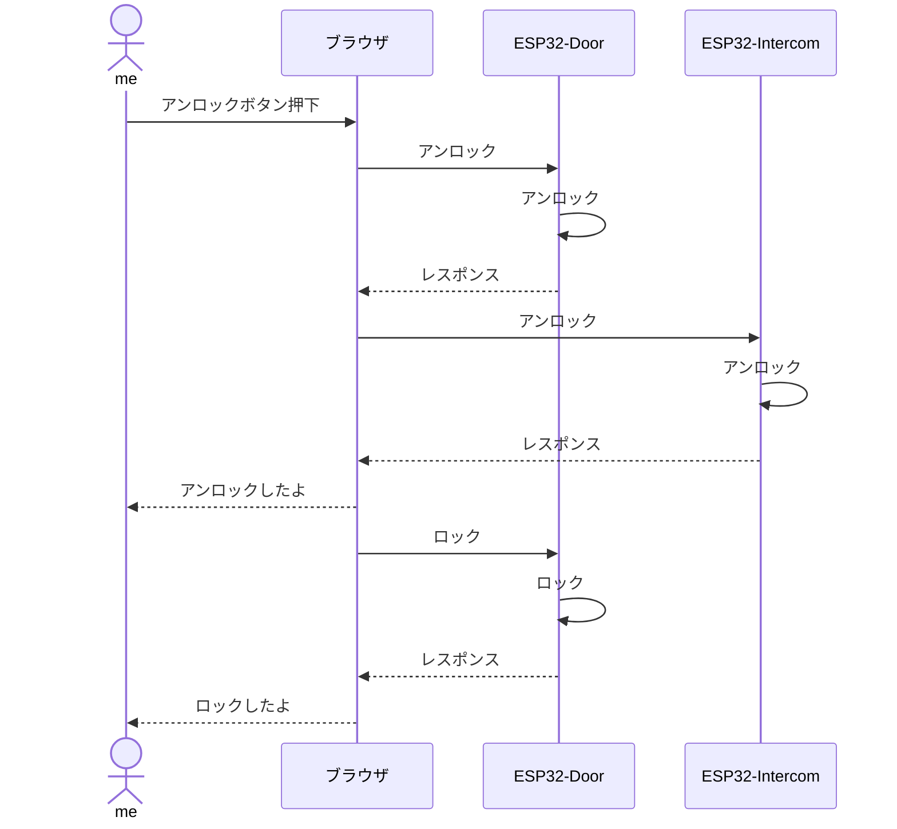

## 作ったもの

* [動画（Twitter）](https://twitter.com/senken00/status/1575869913876484098?s=20&t=YBVjl1Vb69R6ku9nYhXM6Q)
* [ソースコード](https://github.com/senkenn/smart_lock)
  * mainブランチ
    ドア設置のESP32
  * intercomブランチ
    インターフォン設置のESP32

## シーケンス

ブラウザはドア設置のESP32がサーバー。

## 開発環境

[過去のQiitaの記事](https://qiita.com/SENKEN/items/71baa1b2242532658e99)と同じです。

## 開発部品

* ESPRESSIF製 ESP32-WROVER-E(秋月電子) x 2
* ユニバーサルアームセット(秋月電子) x 2
* サーボモーター x 2(Amazonで買ったESP32セットに付属してたやつ)
* ブレッドボード、ジャンバーワイヤーなど、細かい備品

合計4000円くらいといったところでしょうか。まあSwitchBotなどの市販のスマートホーム製品を買うよりは安くついたのでよし！
