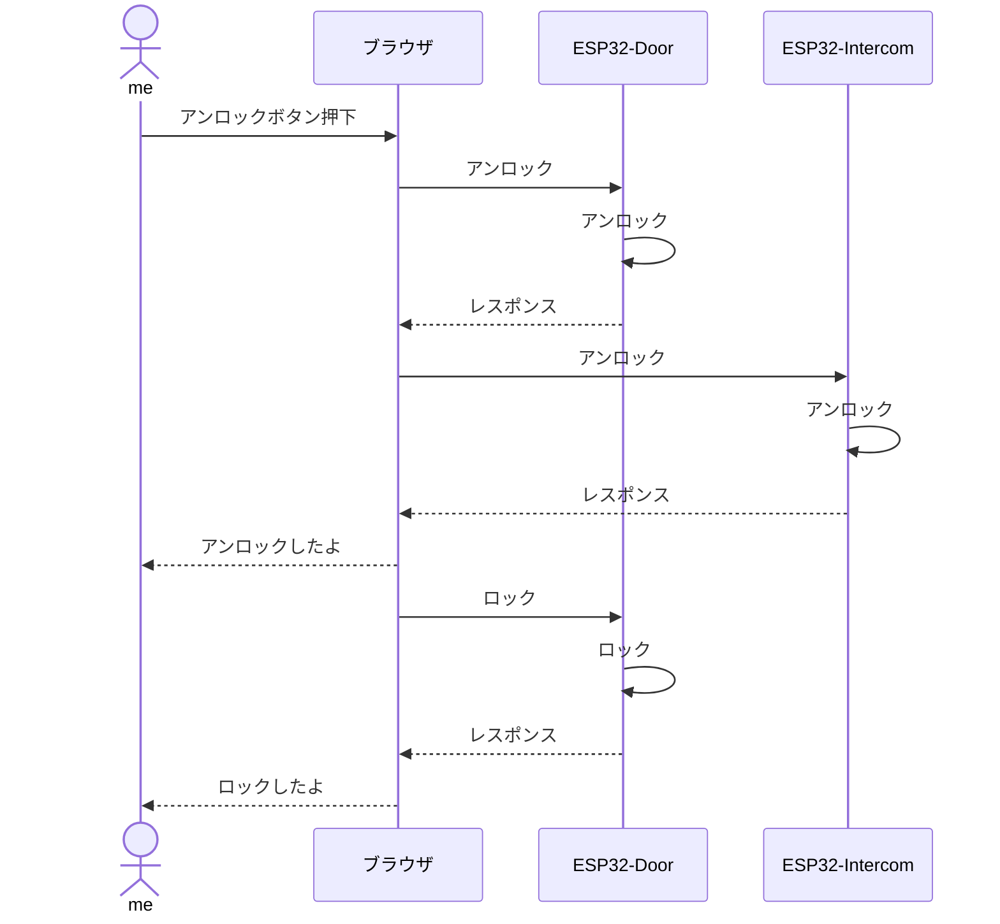

## 作ったもの

@[tweet](https://twitter.com/senken00/status/1575869913876484098?s=20&t=YBVjl1Vb69R6ku9nYhXM6Q)
なぜこんな寒いツイートをしてしまったのか

## ソースコード

[GitHub](https://github.com/senkenn/smart_lock)

* mainブランチ
    ドア設置のESP32
* intercomブランチ
    インターフォン設置のESP32

## シーケンス

ブラウザはドア設置のESP32がサーバー。

## 開発環境

[過去のQiitaの記事](https://qiita.com/SENKEN/items/71baa1b2242532658e99)と同じ

## 開発部品

* ESPRESSIF製 ESP32-WROVER-E(秋月電子) x 2
* ユニバーサルアームセット(秋月電子) x 2
* サーボモーター x 2(Amazonで買ったESP32セットに付属してたやつ)
* ブレッドボード、ジャンバーワイヤーなど、細かい備品

合計4000円くらい。まあSwitchBotなどの市販のスマートホーム製品を買うよりは安くついたのでよし！

なお、回路図は書くのがめんどくさかったので書いていない。真似したい人は参考リンクか、ソースコードから読み取ってください（申し訳ない）。

## 参考リンク

* [ボタン押下時の挙動で参考にしたもの](https://note.com/batabatakun/n/n818fbf5bd811)
* [Webサーバーで参考にしたもの](https://randomnerdtutorials.com/esp32-web-server-spiffs-spi-flash-file-system/)
